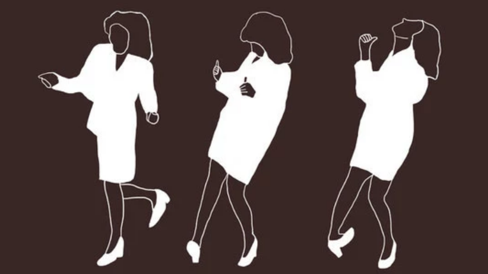

class: inverse, center, middle
##RStudio Server on AWS! 🤠
###Get Started 🤫😴

```{r, out.width = "600px", echo=FALSE}
knitr::include_graphics("George_Desk.gif")
```
---
##Set up an account with [AWS](https://aws.amazon.com/)
```{r, out.width = "650px", echo=FALSE, fig.align = 'center'}

```
---
##Set up VPC (virtual private cloud)
```{r, out.width = "550px", echo=FALSE, fig.align = 'center'}

```
---
class: inverse, center, middle
###Let us learn all of Elaine's moves!!! 😃🎵🎶

```{r, out.width = "300px", echo=FALSE}
knitr::include_graphics("ElainDanceI.png")
```

```{r, out.width = "310px", echo=FALSE}

```
---
##Launch EC2 Instance 
```{r, out.width = "650px", echo=FALSE, fig.align = 'center'}

```
---
###Choose an Amazon Machine Image (AMI) 
```{r, out.width = "700px", echo=FALSE, fig.align = 'center'}

```
###Choose an Instance Type 
```{r, out.width = "700px", echo=FALSE, fig.align = 'center'}

```
---
###Configure Instance Details 
```{r, out.width = "600px", echo=FALSE, fig.align = 'center'}

```
####Set Advance Details 
```{r, out.width = "500px", echo=FALSE, fig.align = 'center'}

```
---
####Pase the code below into Advance Details Box
```{r, out.width = "600px", echo=FALSE, fig.align = 'center'}

```

Note that you will need the latest [RStudio binaries](https://www.rstudio.com/products/rstudio/download-server/)
```{r, out.width = "450px", echo=FALSE, fig.align = 'center'}

```  
---
###Review and Launch Instance
####Edit Security Groups
```{r, out.width = "700px", echo=FALSE, fig.align = 'center'}

```
####Select/Create Key Pair
```{r, out.width = "400px", echo=FALSE, fig.align = 'center'}

```
---
####View Your Instance
```{r, out.width = "600px", echo=FALSE, fig.align = 'center'}

```

```{r, out.width = "600px", echo=FALSE, fig.align = 'center'}

```

```{r, out.width = "600px", echo=FALSE, fig.align = 'center'}

```
---
####Your RStudio in Amazon Cloud
```{r, out.width = "700px", echo=FALSE, fig.align = 'center'}

```
---
class: inverse, center, middle
###We know how to do Elaine's Dance!!! 😃🎵🎶

```{r, out.width = "500px", echo=FALSE}

```
---
class: inverse, center, middle
##RStudio Cloud!😇🎶🎵
###Do the Cosmo Dance?! 🤪🎵🎶
```{r, out.width = "550px", echo=FALSE}

```
---
###Instructor: 
##Set up your clasroom: <span style="color:#6f9ec6">`+New Space`</span>
```{r, out.width = "800px", echo=FALSE, fig.align = 'center'}

```
---
###Instructor: 
##Set up a project: <span style="color:#6f9ec6">`Project Tab`</span> 
```{r, out.width = "9000px", echo=FALSE, fig.align = 'center'}

```
---
###Instructor: 
##Add your students: <span style="color:#6f9ec6">`Members`</span>
```{r, out.width = "900px", echo=FALSE, fig.align = 'center'}

```
---
###Student: 
##Check your emails and Join the clasroom 🧐
```{r, out.width = "600px", echo=FALSE, fig.align = 'center'}

```
---
###Student:
##Check the <span style="color:#6f9ec6">Project</span>
####Save a Permanent Copy of the <span style="color:#e8a4b7">TEMPORARY</span> Project 
```{r, out.width = "700px", echo=FALSE, fig.align = 'center'}

```
---
###Student: 
##Working on project 🤔😓🤔😅🤓😎🤠
```{r, out.width = "950px", echo=FALSE, fig.align = 'center'}

```
---
###Instructor: 
##Check student's work 🧐🤗😇🎶🎵
```{r, out.width = "900px", echo=FALSE, fig.align = 'center'}

```
---
class: inverse, center, middle
###Everybody Loves RStudio Cloud Dance 😇🎶🎵
```{r, out.width = "600px", echo=FALSE, fig.align = 'center'}
knitr::include_graphics("SeinfeldDance.gif")
```
---
class: inverse, center, middle

# Thanks!

###[www.datateka.com](www.datateka.com) 

[tanjakec.github.io](tanjakec.github.io)

@DataTeka 

@Tatjana_Kec


Slides created via the R package [**xaringan**](https://github.com/yihui/xaringan).

The chakra comes from [remark.js](https://remarkjs.com), [**knitr**](http://yihui.name/knitr), and [R Markdown](https://rmarkdown.rstudio.com).
